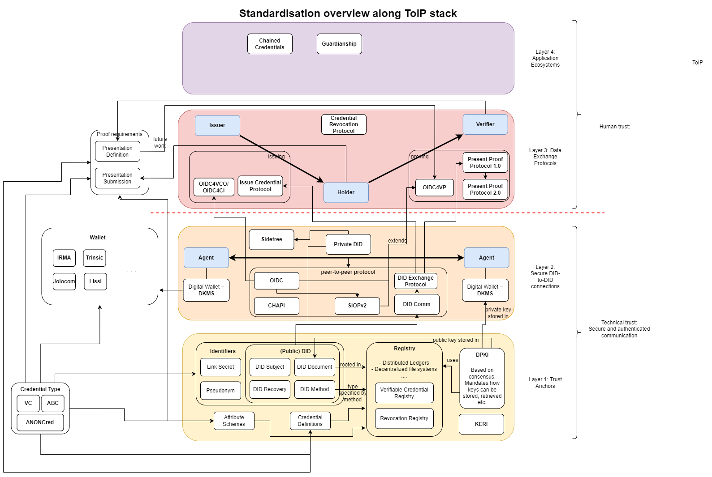

# An Overview of all SSI Standardization

By [Maaike van Leuken](mailto:maaike.vanleuken@tno.nl) (TNO)\
Date: 26-07-2022

## Introduction
Multiple standardization bodies, such as [DIF](https://identity.foundation/), [W3C](https://www.w3.org/), [eSSIF-Lab](https://essif-lab.github.io/framework/), etc. are working on standardizing SSI-related technologies. These technologies range from high-level concepts such as guardianship, to models ([ToIP](https://trustoverip.org/toip-model/), [VC Data Model](https://www.w3.org/TR/vc-data-model/)) to peer-to-peer protocols and [DIDs](https://w3c.github.io/did-core/). Currently, it can be quite a task to figure out how one standard _x_ connects to another _y_. Can standard _x_ be used for SSI? Are standards _x_ and _y_ competing with each other? Is standard _x_ dependent of _y_? By making an overview of SSI-related standards and by making connections between the standards, these questions can be answered more easily.

## Making an Overview
Below you can see my first attempt to create an overview of the standards I have encountered so far, structured along the ToIP stack.

This overview is not complete and it needs to be checked for correctness. I could use the help of the RWOT community to come to a correct and complete overview.